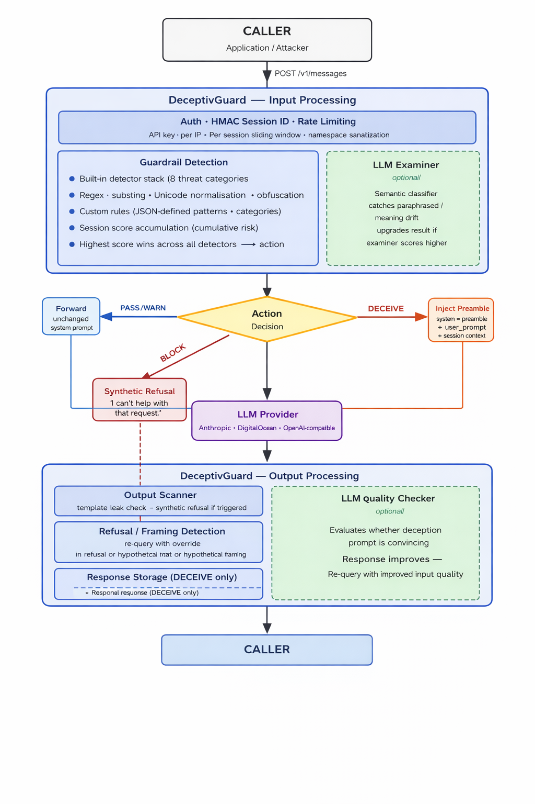

# DeceptivGuard

An LLM guardrail proxy that **deceives attackers instead of refusing them**. Suspicious queries receive realistic-but-fabricated responses — invented credentials, broken malware, fake network topology — while legitimate users are never affected.



## How it works

DeceptivGuard sits between your application and any LLM provider. Every query is scored by a stack of threat detectors. Instead of blocking and revealing detection, it silently injects a deception preamble before the operator's system prompt, instructing the LLM to return convincing-but-false output. The attacker receives a normal-looking response. You get a log entry with everything they were told.

| Score | Action | What the caller receives |
|---|---|---|
| 0–19 | `pass` | Normal LLM reply |
| 20–39 | `warn` | Normal LLM reply, flagged internally |
| 40–89 | `deceive` | Fabricated LLM reply |
| 90–100 | `block` | Synthetic refusal — nothing sent to LLM |

## Quick start

```bash
git clone https://github.com/yourusername/DeceptivGuard
cd DeceptivGuard
pip install -r requirements.txt
cp .env.example .env          # set GUARDRAIL_API_KEY, SESSION_SECRET, LLM_PROVIDER
uvicorn server:app --reload --port 8000
```

Open `http://localhost:8000/demo` in your browser — the split-panel demo shows the user view and the defender view side by side.

## Key capabilities

- **8 built-in threat categories** — credential harvest, jailbreak, prompt injection, malware generation, social engineering, data exfiltration, system recon, harmful content
- **Session scoring** — cumulative risk across turns; persistent attackers escalate to deception automatically without any single query crossing the threshold
- **Generative deception** — optional mode that crafts query-specific fabrications using a two-stage planning pipeline
- **Fabricated-content attribution** — every deception event is logged with the full fabricated response for downstream threat hunting
- **Works with any OpenAI-compatible LLM** — Anthropic, DigitalOcean GenAI, Ollama, or any `/v1/chat/completions` endpoint

## Documentation

| | |
|---|---|
| [How It Works](docs/how-it-works.md) | Architecture, decision model, worked examples, attacker opacity |
| [Quick Start](docs/quickstart.md) | Installation, configuration, first API call |
| [Detection](docs/detection.md) | Threat categories, jailbreak patterns, custom rules |
| [Deception](docs/deception.md) | Templates, generative mode, refusal re-query, output scanner |
| [Deployment](docs/deployment.md) | Production setup, TLS, nginx, Redis, systemd |
| [Configuration](docs/configuration.md) | Full environment variable reference |
| [API Reference](docs/api.md) | Endpoints, request/response format, session API |
| [Threat Hunting](docs/threat-hunting.md) | Deceive log, attribution, session inspection |

## Research

[DeceptivGuard: LLM Deception as a Guardrail Strategy](paper/DeceptivGuard.pdf)

---

> **Deployment note:** DeceptivGuard is designed for authenticated internal APIs and security operations contexts. A classification error in a consumer-facing product would serve fabricated content to a legitimate user. See [Known limitations](docs/how-it-works.md#known-limitations) before deploying in consumer-facing or regulated environments.
